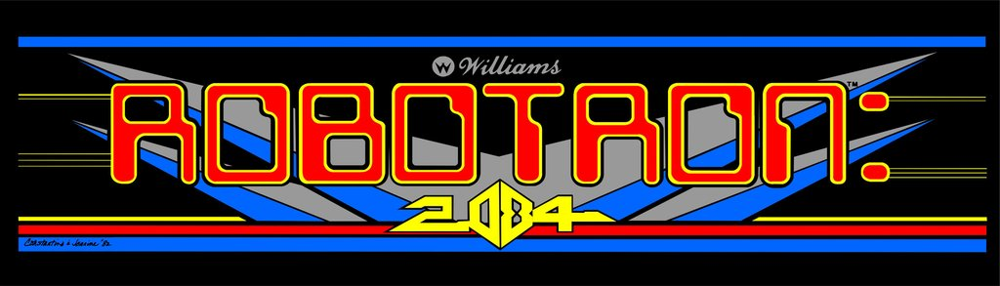
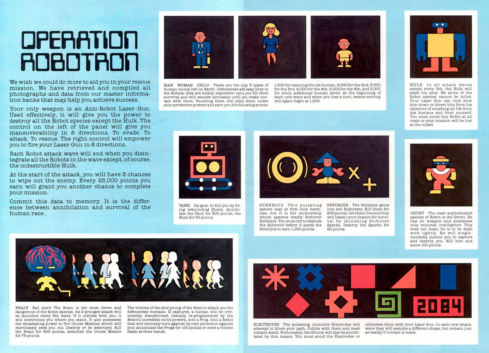

# 

## Getting started

Install python [v3.11.1](https://www.python.org/downloads/release/python-3111) **IMPORTANT**: Make sure to check the option to add python to path during installation!

Once installed, set up a virtual environment using the following command: `python -m venv /path/to/new/virtual/environment`

This will create a target directory along with a .venv that contains the virtual environment.

Then git clone the project into the newly created project folder.

Make sure your IDE is connected to the new virtual environment -> this step will be specific to your IDE.

Once you have cloned the repo and are in the virtual environment, use the command: `pip install -r requirements.txt`. This will install the package requirements for the project.

Lastly, to execute the program you just need to run the 'game.py' file. `python game.py`

## Reference Material
[Robotron: 2084 Atari 7800  FAQ/Strategy Guide](https://gamefaqs.gamespot.com/atari7800/585425-robotron-2084/faqs/42864)  
[Robotron wave information](https://www.seanriddle.com/robowaves.html)
[Robotron: 2084 - Trivia](https://gamefaqs.gamespot.com/arcade/584169-robotron-2084/trivia)
[Robotron: 2084 - FAQ](https://gamefaqs.gamespot.com/arcade/584169-robotron-2084/faqs/24698)

## Game Backstory

Below is the original backstory to Robotron published at launch:

